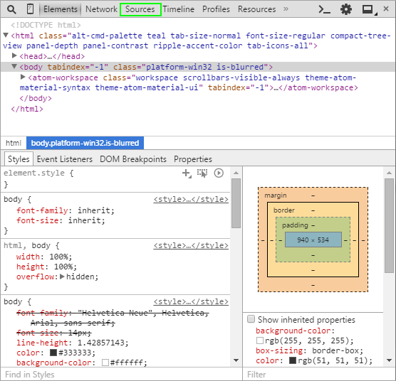

# Atom line-ending-selector error
<br/>
<center>
<a href='http://www.atom.io'></a>
</center>
<br/>

Today I installed the beautiful [Atom editor](http://www.atom.io/) on my Ubuntu 14.10 system.

Immediately I received an error message:
```
Uncaught TypeError: object is not a function

At /usr/share/atom/resources/app.asar/node_modules/line-ending-selector/lib/main.js:74

TypeError: object is not a function
    at Object.consumeStatusBar (/usr/share/atom/resources/app.asar/node_modules/line-ending-selector/lib/main.js:74:23)
    at Provider.module.exports.Provider.provide (/usr/share/atom/resources/app.asar/node_modules/service-hub/lib/provider.js:30:52)
    at /usr/share/atom/resources/app.asar/node_modules/service-hub/lib/service-hub.js:55:26
    at doNTCallback0 (node.js:416:9)
    at process._tickCallback (node.js:345:13)
```

There's several pieces of info going on here, so what can I do to find out more?

In Atom you can open a developer console similar to one you'll find in your web browser.
This console will let you browse through the source files loaded by Atom, among a plethora of other info.

#### What's going on here?

To open the console, click: ```View > Developer > Toggle Developer Tools```.

  <figure style="max-width: 40em;" class="figure center-block">
      <a href="./images/atom_devconsole.png">
          
      </a>
      <figcaption class="figure-caption text-right">
          The Atom developer console - select the Sources tab.
      </figcaption>
  </figure>
