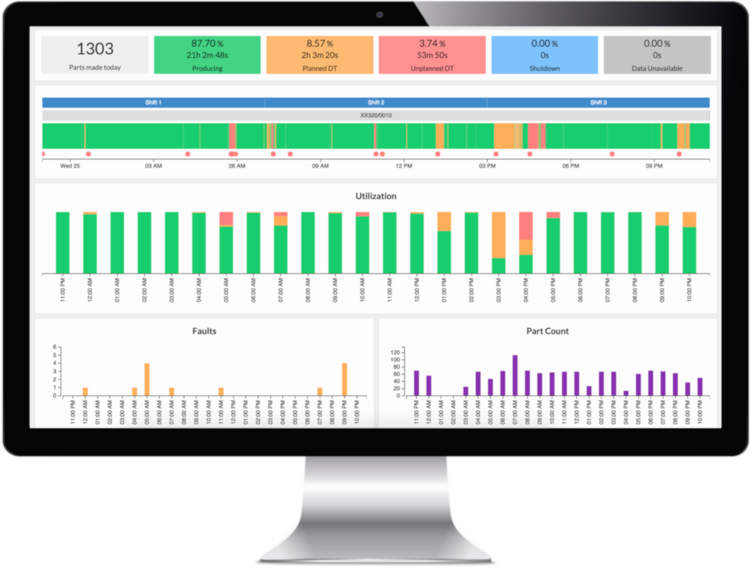
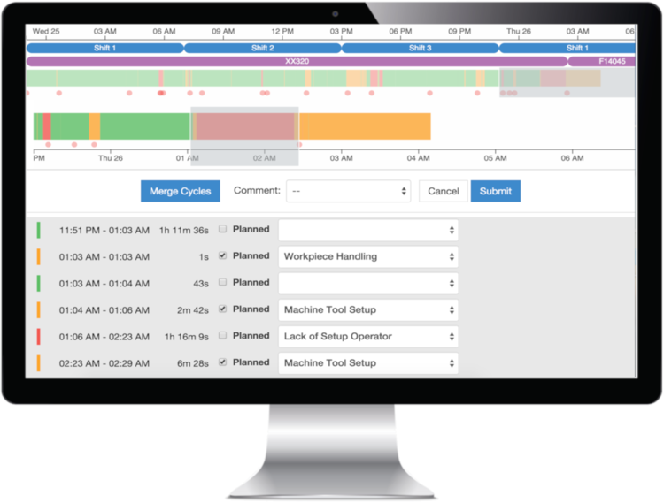
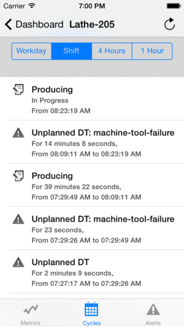
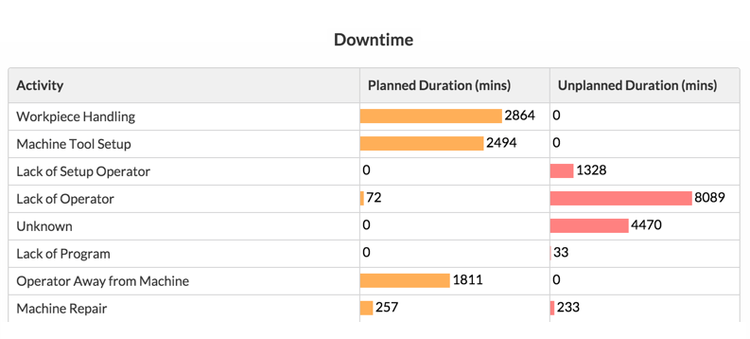

    <h1>Dashboard/OEE Project</h1>

    

## Background ##
KPIs derived from NOV's current data sources are inaccurate.
NOV can undertake a series of projects to automatically gather accurate info, and present that info in a meaningful way.

## Goals ##

* Provide managers with accurate, meaningful KPIs.
* Lay foundation to expand finished product to other facilities

## Example Features ##

    
    
    

## Scope ##
The end result of the project is a package of software & hardware that can be deployed at any manufacturing facility in NOV.

## Phases ##

* Identify the users of the system
    - How many different user categories will there be?
    - Which users are high priority for pilot project?

* Identify dashboard data goals
    - Which metrics are relevant to which users?
    - Which areas of the shop are candidates for pilot implementations?

* Identify required inputs for dashboard to function
    - Which inputs will be out of scope?
        * Oracle / Glovia / Kronos involvement
        * IT involvement
        * Etc...

* Evaluate third-party vendor Software

* Evaluate project to develop in-house solution

## Stakeholders ##
| Role | Stakeholder |
| - | - |
| Client / Sponsor | Joel Lopez |
| Project Manager | Kyle Pittman |
| Team members | TBD |

## Budget Elements ##
The following are necessary cost elements of the project:

1. Software & supporting hardware purchases, est. $70k-$120k for outright purchase
    - SaaS vendors allow us to pay month-to-month = lower capital expenditure requirement
2. Software implementation, training, and maintenance, est. $20k
3. Ancillary PC hardware (servers, terminals, heads-up displays, tablets), est. $10k-$20k
    - This is purchased through our IT department
4. Indirect Labor: Project Manager, team, external departments' assistance

## Constraints, Assumptions, Risks and Dependencies ##

#### Assumptions ####
We assume the following conditions to be true or fulfilled for the project to be successful:

* The project is supported by all departments involved
* The project team is able to fully devote their working time to this project
* The budget is adequate to cover the scope of the project

#### Risks ####
* Unforseen technical incompatibilities with Glovia / Oracle / Other external systems (Moderate likelihood)
* Unforseen technical incompatibilities with CNC machines or welding robots (Low likelihood)

#### Dependencies ####
* There will be deliverables that must be handled by other teams with other managers
* The vendor or developers need to be readily available when the project kicks off
